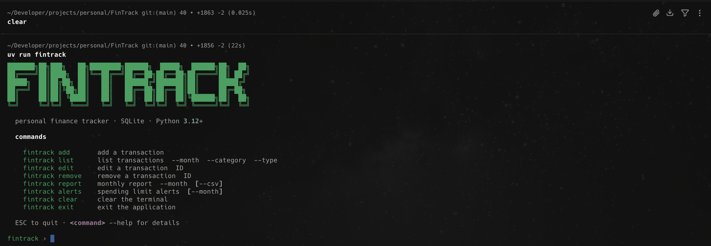

> Personal finance tracker CLI — transactions, monthly reports, and per-category spending alerts.


---

## Stack

| Layer | Technology |
|---|---|
| CLI | [Click](https://click.palletsprojects.com/) + [Rich](https://github.com/Textualize/rich) |
| Persistence | SQLite via `sqlite3` (stdlib) |
| Package manager | [uv](https://docs.astral.sh/uv/) |
| Linter / Formatter | [Ruff](https://docs.astral.sh/ruff/) |
| Tests | pytest + pytest-cov |

---

## Architecture

The project follows a layered architecture with clear separation of concerns:

```
CLI (click)
  └── Services (business logic)
        └── Repositories (abstract interface)
              └── SQLite (concrete implementation)
```

```
src/
├── cli/
│   ├── main.py              # entry point, interactive REPL
│   ├── transactions.py      # add · list · edit · remove
│   ├── reports.py           # report
│   └── alerts.py            # alerts
├── models/
│   ├── Transaction.py       # dataclass with validations
│   ├── Category.py          # name + monthly limit
│   ├── Report.py            # monthly aggregations
│   └── enums.py             # TransactionType (income | expense)
├── repositories/
│   ├── TransactionRepository.py      # ABC interface
│   ├── SQLiteTransactionRepository.py
│   ├── CategoryRepository.py
│   ├── SQLiteCategoryRepository.py
│   ├── ReportRepository.py
│   └── SQLiteReportRepository.py
├── services/
│   ├── TransactionService.py   # CRUD + orchestration
│   ├── ReportService.py        # monthly aggregations
│   └── AlertService.py         # detects categories over limit
└── tests/
    ├── unit/                   # model validation & business rules
    └── integration/            # SQLite repositories (temp database)
```

Repositories implement abstract interfaces (`ABC`), allowing the persistence backend to be swapped without touching services or CLI.

---

## Installation

**Prerequisite:** [`uv`](https://docs.astral.sh/uv/getting-started/installation/)

```sh
git clone https://github.com/joaoclaudioprestes/FinTrack.git
cd FinTrack
make setup
```

The database is created automatically at `~/.fintrack/fintrack.db` on first run.

`FINTRACK_DB` overrides the default path:

```sh
FINTRACK_DB=/tmp/test.db fintrack list
```

---

## Usage

Running `fintrack` without arguments opens an interactive REPL:

```
$ fintrack
```

```
$ fintrack add --amount 4500 --type income --category Salary --description "June salary"
Transaction #1 created.

$ fintrack add --amount 320 --type expense --category Food --category-limit 500 --description "Supermarket"
Transaction #2 created.

$ fintrack list --month 2026-06
 ID   Date         Type      Amount          Category   Description
 ──── ──────────── ───────── ─────────────── ────────── ──────────────
 1    2026-06-01   income    R$  4,500.00    Salary     June salary
 2    2026-06-10   expense   R$    320.00    Food       Supermarket

$ fintrack report --month 2026-06
         Report — 2026-06
 ──────────────────────────────────────
  Field     │ Amount
 ───────────┼───────────────────────
  Income    │  R$ 4,500.00
  Expenses  │  R$   320.00
  Balance   │  R$ 4,180.00

$ fintrack alerts --month 2026-06
No categories exceeded their limit in 2026-06.
```

### Command reference

```
fintrack add
  --amount FLOAT          transaction amount              (required)
  --type [income|expense] type                            (required)
  --category TEXT         category name                   (required)
  --description TEXT      description                     (required)
  --date YYYY-MM-DD       date (default: today)           (optional)
  --category-limit FLOAT  monthly category limit          (optional)

fintrack list
  --month YYYY-MM         filter by month
  --category TEXT         filter by category
  --type [income|expense] filter by type

fintrack edit ID
  --amount --date --type --category --category-limit --description

fintrack remove ID

fintrack report
  --month YYYY-MM         report month                    (required)
  --csv                   export as CSV

fintrack alerts
  --month YYYY-MM         month (default: current month)
```

---

## Development

```sh
make format      # ruff format + autofix
make lint        # ruff check
make test        # pytest
make test-cov    # pytest --cov (HTML report → htmlcov/)
make verify      # format-check + lint + test
```

### Tests

```sh
$ make test
43 passed in 0.05s
```

Coverage focused on critical business rules in `services/` and `models/` validations. Integration tests hit a real SQLite database (temp file) — no mocks.

---

## License

[MIT](LICENSE)
